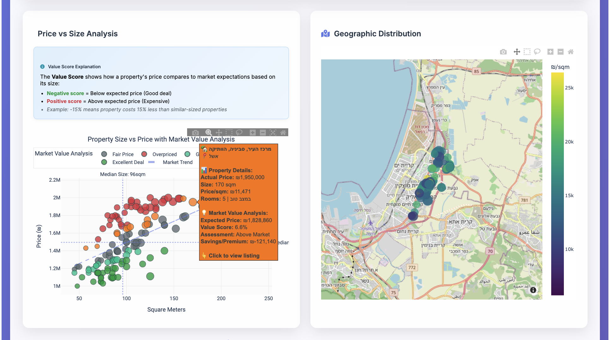
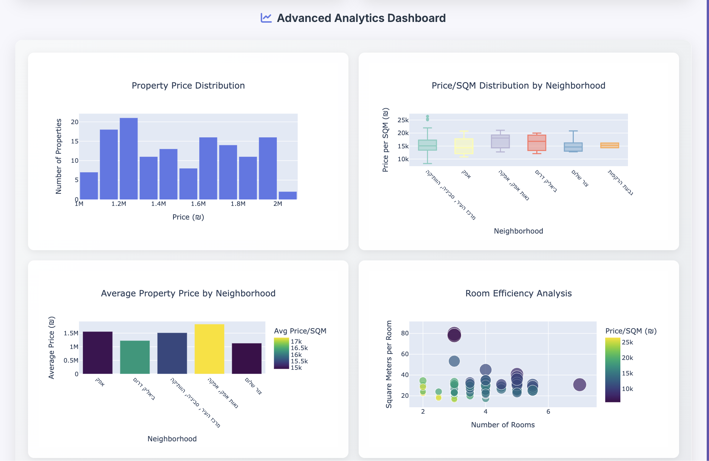
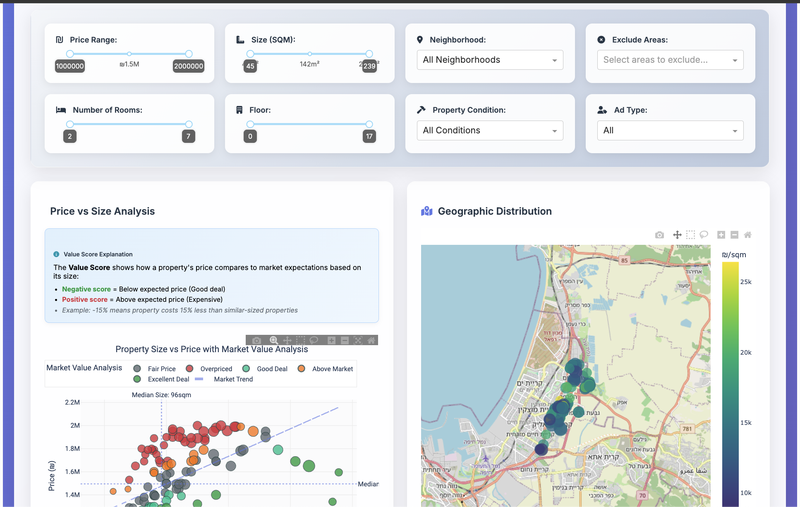
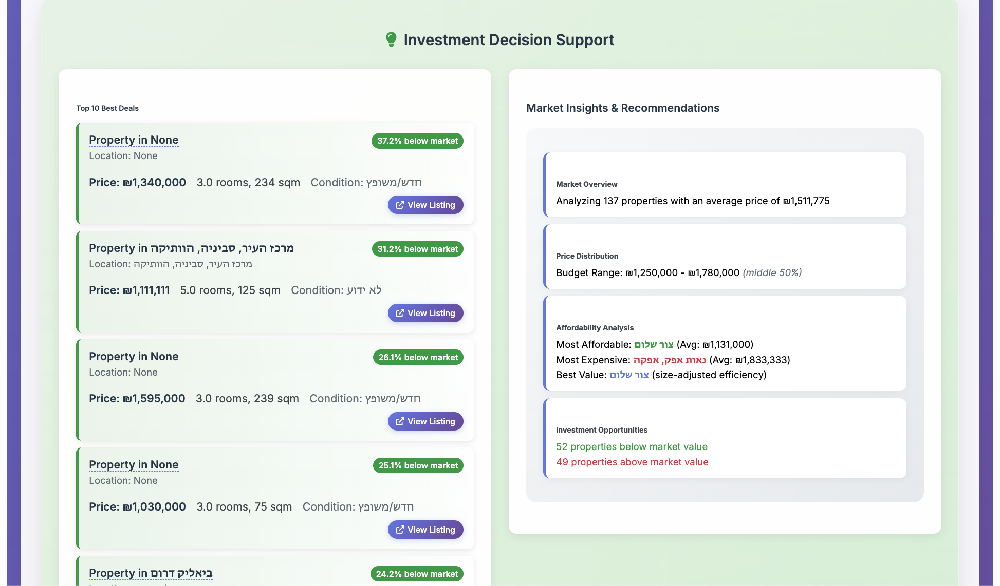

# 🏠 Real Estate Analyzer

A comprehensive real estate market analysis tool that scrapes property data from Yad2 and provides interactive visualizations, market insights, and investment recommendations.

## ✨ Features

### 🔍 Data Collection

- **Real-time scraping** from Yad2 (Israel's leading real estate platform)
- **Flexible search parameters** (price range, location, property type, etc.)
- **Automatic data validation** and quality assurance
- **Historical data preservation** with timestamped datasets

### 📊 Advanced Analytics

- **Market value analysis** with trend-based scoring
- **Geographic visualization** with interactive maps
- **Neighborhood comparison** and ranking
- **Price distribution analysis** and statistical insights
- **Best deals identification** using ML-powered algorithms

### 🎯 Interactive Dashboard

- **Dual-view interface** (scatter plots + maps)
- **Real-time filtering** by price, size, location, and more
- **Click-to-view** property listings
- **Responsive design** for desktop and mobile
- **Export capabilities** for charts and data

## 📸 Dashboard Gallery

### Main Dashboard Interface


_Main dashboard showing scatter plot analysis and interactive map view_

### Advanced Analytics


_Detailed analytics including efficiency metrics and statistical visualizations_

### Interactive Features


_Intuitive search interface for collecting new property data_

### Investment Tools


_Investment decision support with recommendations and market intelligence_

## 🚀 Quick Start

### Prerequisites

- Python 3.8 or higher
- Git

### Installation

1. **Clone the repository**

   ```bash
   git clone https://github.com/yourusername/real-estate-analyzer.git
   cd real-estate-analyzer
   ```

2. **Install dependencies**

   ```bash
   pip install -r requirements.txt
   ```

3. **Set up environment** (optional)

   ```bash
   python setup_env.py
   ```

4. **Run the application**

   ```bash
   python main.py
   ```

5. **Open your browser**
   ```
   http://localhost:8051
   ```

## 📖 Usage Guide

### Starting the Dashboard

```bash
# Basic usage
python main.py

# Custom port
python main.py --port 8080

# Debug mode
python main.py --debug

# Custom data directory
python main.py --data-dir /path/to/data
```

### Scraping New Data

1. **Configure search parameters** in the dashboard

   - Select city and area
   - Set price range and property criteria
   - Specify room count and size requirements

2. **Click "Scrape New Data"** to fetch latest listings

3. **Wait for processing** (typically 30-60 seconds)

4. **Explore results** using interactive filters and visualizations

### Understanding Market Value Analysis

The application uses proprietary algorithms to calculate **Value Scores**:

- **Negative scores** = Below market price (good deals)
- **Positive scores** = Above market price (expensive)
- **Categories**: Excellent Deal, Good Deal, Fair Price, Above Market, Overpriced

## ⚙️ Configuration

### Adding New Cities

To add support for additional cities, modify the constants file:

1. **Edit the constants file**

   ```bash
   nano src/config/constants.py
   ```

2. **Add new city to CityOptions class**

   ```python
   class CityOptions:
       """Available city options for scraping."""
       CITIES = [
           {'label': 'קרית ביאליק', 'value': 9500},
           {'label': 'תל אביב-יפו', 'value': 5000},
           {'label': 'ירושלים', 'value': 3000},
           {'label': 'חיפה', 'value': 8600},
           # Add your new city here:
           {'label': 'YOUR_CITY_NAME', 'value': YOUR_CITY_ID},
       ]
   ```

3. **Find City IDs**

   - Visit Yad2.co.il
   - Search for properties in your desired city
   - Check the URL for the city parameter
   - Use that numeric ID in the configuration

4. **Add corresponding areas** (if needed)
   ```python
   class AreaOptions:
       """Available area options for scraping."""
       AREAS = [
           {'label': 'Your Area Name', 'value': area_id, 'city': your_city_id},
           # ... existing areas
       ]
   ```

### Environment Configuration

Create a `.env` file for sensitive settings:

```bash
# Data directories
DATA_DIRECTORY=data/scraped
EXPORT_DIRECTORY=data/exports

# Server settings
SERVER_HOST=0.0.0.0
SERVER_PORT=8051
DEBUG_MODE=False

# Scraping settings
REQUEST_TIMEOUT=30
RATE_LIMIT_DELAY=1.0
MAX_RETRIES=3
```

## 🏗️ Project Structure

```
real_estate_analyzer/
├── src/
│   ├── analysis/           # Data analysis and filtering
│   ├── config/             # Configuration and constants
│   ├── dashboard/          # Web dashboard components
│   ├── data/               # Data models and loaders
│   ├── scraping/           # Web scraping utilities
│   ├── utils/              # Utility functions
│   └── visualization/      # Charts and interactive components
├── tests/                  # Unit and integration tests
├── data/                   # Data storage directory
├── docs/                   # Documentation and images
├── requirements.txt        # Python dependencies
├── main.py                 # Main application entry point
└── README.md              # This file
```

## 🧪 Development

### Setting Up Development Environment

1. **Install development dependencies**

   ```bash
   pip install -r requirements/dev.txt
   ```

2. **Run tests**

   ```bash
   # All tests
   python -m pytest tests/

   # Specific test category
   python -m pytest tests/unit/
   python -m pytest tests/integration/
   ```

3. **Code quality checks**

   ```bash
   # Format code
   black src/ tests/

   # Check types
   mypy src/

   # Lint code
   flake8 src/ tests/
   ```

### Project Architecture

The application follows a modular architecture:

- **Data Layer**: Models, loaders, and validation
- **Analysis Layer**: Statistical analysis and market insights
- **Visualization Layer**: Charts, maps, and interactive components
- **Dashboard Layer**: Web interface and user interactions
- **Scraping Layer**: Data collection from external sources

### Key Components

#### Visualization Factory

```python
from src.visualization.charts.factory import PropertyVisualizationFactory

# Create all charts at once
factory = PropertyVisualizationFactory(property_data)
charts = factory.create_all_charts()
```

#### Market Analysis

```python
from src.analysis.market_analysis import MarketAnalyzer

analyzer = MarketAnalyzer(property_data)
insights = analyzer.generate_market_insights()
```

#### Data Filtering

```python
from src.analysis.filters import PropertyDataFilter

filter_engine = PropertyDataFilter(property_data)
filtered_data = filter_engine.apply_all_filters(filter_params)
```

## 📊 Analytics Features

### Market Value Scoring

- **Trend-based analysis** using polynomial regression
- **Percentile ranking** within market segments
- **Combined scoring algorithm** for accurate valuations
- **Category classification** for easy interpretation

### Statistical Analysis

- **Price distribution** analysis and outlier detection
- **Neighborhood comparison** with affordability metrics
- **Room efficiency** analysis and optimization
- **Market trend** identification and forecasting

## 🔧 Troubleshooting

### Common Issues

**Port already in use**

```bash
python main.py --port 8052
```

**Data loading errors**

- Check file permissions in data directory
- Verify CSV file format and encoding
- Run with `--debug` for detailed error messages

**Scraping failures**

- Check internet connectivity
- Verify city/area IDs are correct
- Reduce search criteria scope

**Performance issues**

- Filter data to smaller date ranges
- Use `--data-dir` to point to SSD storage
- Increase system memory allocation

### Debug Mode

Enable debug mode for development:

```bash
python main.py --debug
```

This provides:

- Hot reloading for code changes
- Detailed error traceback
- Performance profiling information
- Extended logging output

## 📈 Data Sources

- **Primary**: Yad2.co.il API
- **Geographic**: OpenStreetMap integration
- **Market Data**: Internal algorithms and statistical analysis

## 🚀 Future Plans

We have exciting plans to enhance the Real Estate Analyzer with more advanced features and improved user experience:

### 🌐 Dynamic Location Discovery

- **Autocomplete Search**: Dynamically retrieve cities and area codes using Yad2's search API endpoint, allowing autocomplete of the full city list

### 🗺️ Interactive Map Filtering

- **Geographic Selection**: Filter properties by drawing rectangles or polygons directly on the map and utilizing the location search API endpoints
- **Coordinate-based Search**: Use longitude and latitude coordinates for precise area filtering

### 📅 Advanced Temporal Filtering

- **New Listings Only**: Filter to show only recently posted advertisements
- **Date Range Selection**: Specify custom date ranges for listing publication

_Note: Date filtering implementation depends on Yad2 API capabilities and requires further research into available endpoints._

### 📝 Enhanced Property Details

- **Rich Hover Information**: Display full property descriptions in hover tooltips
- **Image Previews**: Show property photos directly in the dashboard

_Note: Description availability depends on Yad2 API access to detailed property data._

### 🤖 AI-Powered Features (Extra Future)

- **Price Prediction**: Machine learning models for more accurate property valuation
- **Market Trend Forecasting**: Predict future price movements in different neighborhoods
- **Investment Recommendations**: AI-powered suggestions for best investment opportunities

### 🔗 Integration Capabilities (Extra Future)

- **Multiple Data Sources**: Support for additional real estate platforms, like Madlan

---

**Timeline**: These features are planned for future releases. Implementation priority will be based on user feedback and technical feasibility.

**Contributing**: Interested in helping implement these features? Check out our [Contributing Guidelines](#-contributing) below!

## 🤝 Contributing

1. **Fork the repository**
2. **Create a feature branch** (`git checkout -b feature/amazing-feature`)
3. **Make your changes** and add tests
4. **Run the test suite** (`python -m pytest`)
5. **Commit your changes** (`git commit -m 'Add amazing feature'`)
6. **Push to the branch** (`git push origin feature/amazing-feature`)
7. **Open a Pull Request**

### Code Style

- Follow PEP 8 guidelines
- Use type hints for all functions
- Write comprehensive docstrings
- Add unit tests for new features
- Update integration tests as needed

## 📝 License

This project is licensed under the MIT License

## 🏗️ Project Origins

This Real Estate Analyzer project evolved from the original [yad2listings](https://github.com/TamirMa/yad2listings) project by **@TamirMa**, which provided a simple viewer for Yad2 vehicle listings on a graph.

**Original Project Features:**

- Vehicle price analysis and visualization
- Yad2 API integration for automotive data
- Basic scatter plot visualization
- Manufacturer and model-specific searches

**Our Evolution:**
We've transformed the core concept into a comprehensive real estate analysis platform, expanding from simple vehicle listing visualization to:

- Advanced property market analysis with ML-powered valuation
- Interactive maps and multi-chart dashboards
- Sophisticated filtering and neighborhood comparisons
- Investment decision support tools

## 🙏 Acknowledgments

- **@TamirMa** for the original [yad2listings](https://github.com/TamirMa/yad2listings) project that inspired this real estate analyzer
- **Plotly & Dash** for excellent visualization frameworks
- **Pandas & NumPy** for powerful data manipulation
- **Yad2** for providing real estate data
- **OpenStreetMap** for geographic visualization

---

**Made with ❤️ for people looking for real estate**
